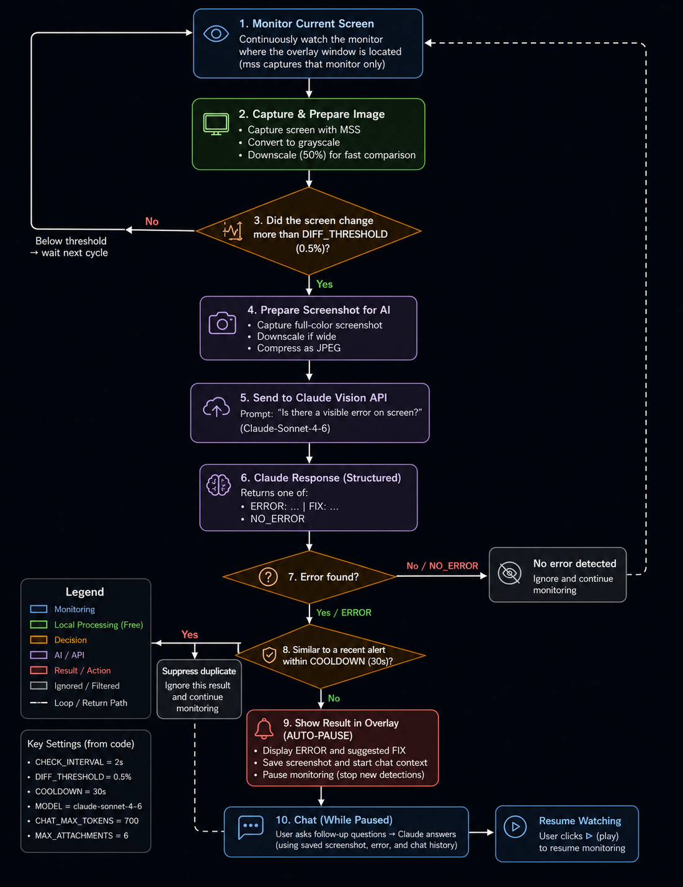

# Screen Error Watcher

An AI-powered desktop troubleshooting assistant that continuously monitors your screen for technical issues and provides instant, context-aware solutions using Claude Vision.

Unlike traditional error lookup tools, Screen Error Watcher automatically detects visible software problems—including exceptions, failed commands, syntax errors, validation messages, warning icons, and abnormal application states—then pauses monitoring and lets you continue troubleshooting through an interactive AI chat.

The project demonstrates how modern AI can augment IT support by combining real-time screen monitoring, computer vision, OCR, and conversational troubleshooting into a lightweight Windows desktop application.

---

## Live Demo


[](https://screen-error-watcher.streamlit.app/)


## Features

### Automatic Error Detection

- Continuously monitors the monitor containing the overlay window
- Detects visible screen changes using local pixel-difference analysis
- Captures screenshots only when significant changes occur
- Uses Claude Vision to identify:
  - Application errors
  - Crash dialogs
  - Terminal failures
  - SQL errors
  - Syntax errors
  - Warning icons
  - Authentication failures
  - Network issues
  - Validation messages
  - UI problems

---

### AI Troubleshooting

When an error is detected, Claude automatically provides:

- Error summary
- Suggested fix
- Practical troubleshooting steps

The application then pauses monitoring so the result remains visible while you investigate.

---

### Interactive AI Chat

After an error is detected you can continue asking follow-up questions such as

- Why did this happen?
- Explain the fix.
- That didn't work.
- What should I try next?
- Can you explain this error?

Claude remembers

- Original screenshot
- Previous conversation
- Detected error
- Attached screenshots
- OCR text
- Active window title

allowing contextual troubleshooting instead of starting from scratch each time.

---

### Screenshot Attachments

You can continue troubleshooting by attaching additional screenshots using

- Ctrl + V
- Drag & Drop
- File Picker

Each image can optionally be processed with OCR before being sent to Claude.

---

### Intelligent Monitoring

The application is designed to minimise unnecessary API usage.

Instead of analysing every frame:

1. Screen captured locally
2. Local grayscale comparison
3. AI called only if the screen changed
4. Duplicate alerts suppressed
5. Monitoring pauses after detection

This keeps API costs extremely low while remaining responsive.

---

## Architecture



---

## Workflow

```text
Watch current monitor
        │
        ▼
Capture screen (MSS)
        │
        ▼
Local pixel-difference detection
        │
        ▼
Screen changed?
        │
   No ─────► Continue monitoring
        │
       Yes
        ▼
Compress screenshot
        │
        ▼
Claude Vision API
        │
        ▼
Visible error?
        │
   No ─────► Continue monitoring
        │
       Yes
        ▼
Duplicate alert?
        │
   Yes ────► Ignore
        │
       No
        ▼
Display error
Pause monitoring
Save chat context
        │
        ▼
Interactive troubleshooting chat
        │
        ▼
User presses ▶ Resume
        │
        ▼
Continue monitoring
```

---

## Technology Stack

| Category | Technology |
|-----------|------------|
| Language | Python |
| GUI | CustomTkinter |
| AI | Claude Sonnet 4.6 Vision |
| Screen Capture | MSS |
| Image Processing | Pillow |
| Numerical Processing | NumPy |
| OCR | Tesseract (optional) |
| Notifications | Overlay UI |
| Threading | Python threading |
| Environment | Windows 10/11 |

---


## Configuration

| Setting | Default | Purpose |
|----------|---------|----------|
| CHECK_INTERVAL | 2 sec | Monitoring frequency |
| DIFF_THRESHOLD | 0.5% | Minimum screen change before AI analysis |
| COOLDOWN | 30 sec | Suppress duplicate detections |
| MODEL | Claude Sonnet 4.6 | Vision model |
| CHAT_MAX_TOKENS | 700 | Follow-up responses |
| MAX_ATTACHMENTS | 6 | Images per conversation |

---

## Performance Optimisations

The application includes several optimisations to minimise latency and API costs.

- Local pixel-difference detection before AI analysis
- JPEG compression before upload
- Automatic image resizing
- Duplicate detection using cooldown
- Background worker threads
- OCR runs only when available
- Monitoring pauses after successful detection
- Conversation context reused for follow-up questions

---

## Privacy

The application

- stores API keys using environment variables
- never hardcodes credentials
- sends screenshots only when necessary
- does not permanently store screenshots
- keeps conversation context only in memory during execution

If handling sensitive information, ensure your organisation permits sending screenshots to external AI services.

---


## Why I Built This

As an IT Support Engineer, I repeatedly followed the same troubleshooting process:

1. Read the error.
2. Search online.
3. Compare multiple solutions.
4. Test possible fixes.

I wanted to reduce that entire workflow to a few seconds.

Screen Error Watcher combines computer vision, desktop monitoring, and conversational AI to automatically detect software problems and provide immediate assistance without interrupting the user's workflow.


